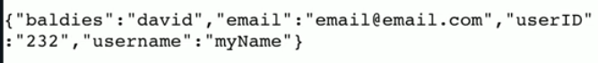

# Incoming!

Today, we're going to learn how to deal with data from forms in Flask.

👉 To start, I've added yesterday's HTML code for my form in `main.py` for you already. (You're welcome!) Go take a look!
##
👉 However, at the moment, the `app.route()` has no method associated with it, so I need to create a route for this page to receive the data.

First, I need a new import: `request`.

Then I create the `app.route` - I also need to add an extra argument to specify the methods being received. At the moment, that's just 'post', but it **does** need to be **ALL CAPS** - `POST`.

Finally I define the `process()` subroutine that returns `request.form`

👉 Here's the new code on its own:

```python
from Flask import Flask, request

app.route('/process', methods=["POST"])

def process():
  return request.form
  
```

👉 And here it is as part of the whole code:

```python
from flask import Flask, request

app = Flask(__name__)

app.route("/process", methods=["POST"])

def process():
  return request.form

  
@app.route('/')
def index():
  page = """<form method = "post" action="/process">
    <p>Name: <input type="text" name="username" required> </p>
    <p>Email: <input type="Email" name="email"> </p>
    <p>Website: <input type="url" name="website"> </p>
    <p>Age: <input type="number" name="age"> </p>
    <input type="hidden" name="userID" value="232"> </p>

    <p>
      Fave Baldy: 
      <select name="baldies">
        <option>David</option>
        <option>Jean Luc Picard</option>
        <option>Yul Brynner</option>
      </select>
    </p>

    <button type="submit">Save Data</button>
  </form>
    
    
    """
  return page
app.run(host='0.0.0.0', port=81)
```


This will get us the data from the form in a dictionary format, like this:


##
👉 Now I can start to add to the `process()` subroutine and use `if` statements to decide what we're going to say depending on the data received. Here's what I've done in the example below:
1. Set up a variable called 'page' as blank, and another called 'form' and assigned the incoming data from the form to it.
2. Use selection to check to see if the user chose 'david' as their favorite baldy. `page +=` means *add to page*.
3. Added a congratulatory message customized with the user's name (I've used single quotes in the fString to get past the possible issue that I've already used doubles earlier in my code.)
4. Added an `else` for those who chose.... unwisely.

```python
def process():
  page = ""
  form = request.form

  if form["baldies"] == "david":
    page += f"You're alright {form['username']}"
  else:
    page += f"You've picked wrong {form['username']}"

  return page
```
### Try it out!