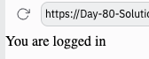
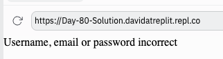

# 👉 Day 80 Challenge

Go and grab your login form code from yesterday. 

Connect it up to Flask.

Make it work.

There should be:

1. Three valid username & password combos.
2. A 'nice' page for valid users.
3. A hideous naughty step of a page for non-valid users/attempted hackers.
    
Example:

 
 💡 Hints 

  
- Use a dictionary to store the valid usernames and passwords.
- Use a Boolean variable to store whether a valid combo is present in the dictionary or not.
- Use `try .... except` to login.

